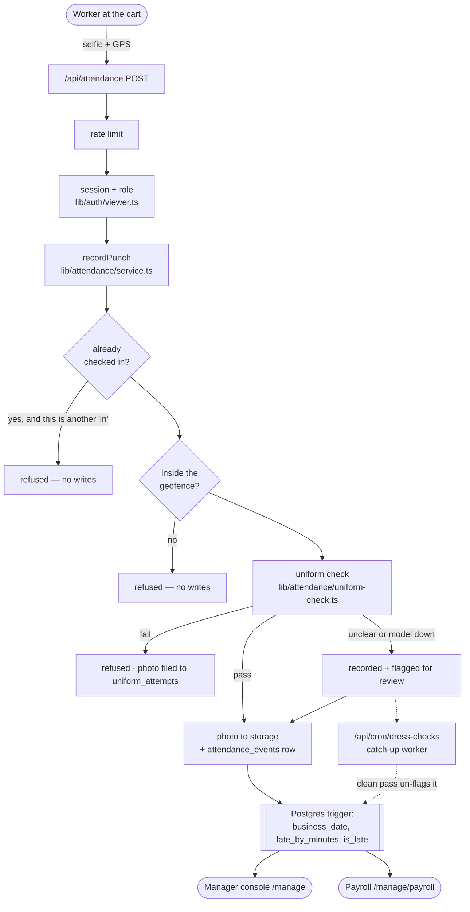

# Shift — attendance, uniform checking and payroll for food carts

A worker signs in, stands at their cart, and takes one selfie. From that single
action the system records **when** they arrived, **where** they were, and
**whether they are in uniform** — and at the end of the month it turns that
record into pay.

**Stack:** Next.js 16 (App Router, React 19) · Clerk Core 3 for auth · Supabase
(Postgres + Storage) for data · Google Gemini for the uniform check · Tailwind 4.

> **New here?** Read [Quick start](#quick-start) to get it running, then
> [How it fits together](#how-it-fits-together) for the mental model, then
> [Code map](#code-map) to know which file to open. Everything after that is
> reference.

---

## Quick start

```bash
npm install
cp .env.local.example .env.local   # then fill it in — see Environment variables
npm run dev:phone                  # or: npm run dev
```

Open <http://localhost:3000>. Browsers only grant camera access on `localhost`
or HTTPS, so a plain `http://` LAN address will not work — `npm run dev:phone`
starts an HTTPS dev server on your network so you can test from a real phone,
which is the only way to get a genuine GPS fix.

You need four things in `.env.local` before anything works:

| | Where to get it |
| --- | --- |
| Clerk publishable + secret key | [dashboard.clerk.com](https://dashboard.clerk.com) → API Keys |
| Supabase URL + **secret** key | [supabase.com/dashboard](https://supabase.com/dashboard) → Project Settings → API Keys. The publishable key will not work — it is a browser key, and the RLS policies deliberately grant it nothing. |
| Gemini API key | [aistudio.google.com](https://aistudio.google.com) |
| `ADMIN_EMAILS` | Your own address. Whoever is on this list becomes the owner. |

Then create the schema, in this order:

```bash
SUPABASE_ACCESS_TOKEN=sbp_... npm run db:migrate -- \
  supabase/schema.sql \
  supabase/attendance.sql \
  supabase/admin.sql \
  supabase/dress-checks.sql \
  supabase/scoring.sql \
  supabase/grading.sql \
  supabase/rbac.sql \
  supabase/reference-descriptions.sql
```

`SUPABASE_ACCESS_TOKEN` is a *personal access token* from
[account/tokens](https://supabase.com/dashboard/account/tokens) — a different
secret from anything in `.env.local`, and one the deployed app never reads. You
can also paste each file into the Supabase SQL editor by hand. Every migration
is additive and idempotent, so re-running one is safe.

### First run, in order

1. Sign in with the address in `ADMIN_EMAILS`. You land in the console as owner.
2. **Carts** → add a cart. Stand at it and press *use my location*, or type the
   coordinates. Set the radius.
3. **Uniforms** → describe the uniform, set the item weights and pass mark, and
   upload a reference photo per garment. The logo cannot be judged without one —
   a written description cannot tell one logo from another.
4. **Staff** → enrol people by email, assign the cart, set shift, grace, salary.
5. They sign in with that address and go straight to `/punch`.

---

## How it fits together



Three ideas explain most of the codebase:

1. **Cheapest check first.** A punch refused at step one pays for nothing — no
   upload, no model call, no write.
2. **Attendance is never blocked by an API being up.** If the uniform check
   cannot answer in time, the shift is still recorded and the uncertainty is
   handed to a manager. Nobody loses a day's pay because Gemini was slow.
3. **Permissions, not roles.** No file asks `role === "admin"`. It asks
   `can(role, "payroll:approve")`, and one table in
   [`src/lib/auth/rbac.ts`](src/lib/auth/rbac.ts) answers.

---

## The check-in, step by step

Follow it through the code — this is the single most useful path to trace.

| # | What happens | Where |
| --- | --- | --- |
| 1 | Browser gets a GPS fix; a stale one counts as none | [`useGeolocation.ts`](src/lib/hooks/useGeolocation.ts) |
| 2 | The screen runs the geofence itself to grey out the shutter | [`geofence.ts`](src/lib/attendance/geofence.ts) |
| 3 | Photo is taken (or picked, or dropped) and shrunk to a 1024 px long edge | [`useSelfieCapture.ts`](src/lib/hooks/useSelfieCapture.ts), [`image.ts`](src/lib/image.ts) |
| 4 | Posted as multipart to the API | [`PunchScreen.tsx`](src/components/punch/PunchScreen.tsx) |
| 5 | Rate limit, session, enrolment, role | [`route.ts`](src/app/api/attendance/route.ts), [`viewer.ts`](src/lib/auth/viewer.ts) |
| 6 | Session rule → geofence → uniform check → write, in that order | [`service.ts`](src/lib/attendance/service.ts) |
| 7 | Gemini judges the selfie against the cart's uniform and reference photos | [`uniform-check.ts`](src/lib/attendance/uniform-check.ts), [`gemini/dresscode.ts`](src/lib/gemini/dresscode.ts) |
| 8 | Bytes to Supabase Storage or Cloudinary; `photos` row either way | [`photos.ts`](src/lib/photos.ts), [`storage/`](src/lib/storage/) |
| 9 | Postgres fills in `business_date`, `late_by_minutes`, `is_late` on insert | [`rbac.sql`](supabase/rbac.sql) §8 |
| 10 | Anything unsettled is picked up later by the cron worker | [`dress-checks.ts`](src/lib/attendance/dress-checks.ts) |

### What the uniform check can decide

| Verdict | Punch recorded? | What the worker sees |
| --- | --- | --- |
| **Pass** | Yes | "Checked in on time. Uniform verified!" |
| **Fail** | **No** | Exactly what is wrong ("no cap, apron worn badly"), camera straight back up. The rejected photo is still filed to `uniform_attempts`, so a manager can see somebody tried four times before putting a cap on. |
| **Unclear** | Yes, flagged | Nothing unusual; a manager sees it in the review queue. |
| **Model unavailable** (timeout, quota, outage) | Yes, flagged and queued | Nothing unusual; the catch-up worker judges it later, and a clean pass un-flags it on its own. |

`UNIFORM_CHECK_TIMEOUT_MS` (9 s by default) is the deadline. The punch screen
also polls a few times after a flagged punch, so a verdict that arrives seconds
late still reaches the worker without waiting for the cron job.

### Late is decided by the manager, not the model

Each worker has a shift start and a **grace window** (30 minutes by default).
Arriving inside it is on time; past it, the day is marked late.

Both `late_by_minutes` (the raw figure, so a manager can still see a 12-minute
arrival) and `is_late` (the judgement) are **stored on the row**, not derived at
read time — because the grace figure can be edited later, and payroll must not
silently re-decide a month that was already approved.

---

## Roles and permissions

Roles are attached to the **email address** a person signs in with, so a manager
can enrol somebody before that person has ever opened the app. The Clerk user id
is bound to the row on first sign-in and only ever fills a blank.

| Role | Can do |
| --- | --- |
| **Staff** | Punch in and out with a selfie. See their own attendance and pay. |
| **Manager** | Everything staff can, plus: set shift times, grace windows and salaries for their own cart; move the cart's geofence pin; review uniform verdicts the model could not settle; prepare payroll. |
| **Owner** (`admin`) | Everything, across every cart, plus the two powers withheld from a manager: **granting roles** and **approving payroll**. Deliberately *not* a worker — an owner never appears on a day sheet or a payroll line. |

Two axes decide access, and they are separate on purpose:

- **Permission** — *what* you may do. [`rbac.ts`](src/lib/auth/rbac.ts).
- **Scope** — *to whom*. A manager holds `staff:write`, but only over their own
  cart. [`scope.ts`](src/lib/manage/scope.ts), applied by every query in
  `src/lib/manage` via `listStaff`.

### Separation of duties

A manager sets salaries and prepares payroll but **cannot approve it**, and
cannot hand out roles. Nobody — not even an owner — can change **their own**
role: demoting yourself is a one-way door, because the permission you would need
to undo it is the one you just gave away.

### The first owner

Granting a role needs the console, and reaching the console needs a role.
`ADMIN_EMAILS` breaks that cycle: any address on that list gets an owner record
the first time it signs in. [`supabase/rbac.sql`](supabase/rbac.sql) seeds the
row so it is already waiting.

---

## How pay is worked out

```
per day     = monthly_salary ÷ working_days_per_month
gross       = per day × min(days present, working days)
deductions  = days late × late_deduction
net         = max(0, gross − deductions)
```

Days present counts **distinct days with a check-in**. Lateness is decided by
the **first** check-in of each day, so somebody who arrives on time, steps out at
noon and punches back in late has not turned up late.

Gross is capped at a full month: covering 28 days against a 26-day basis is an
overtime conversation, not something to pay out silently. To make a late day a
**half day**, set the deduction to half of one day's pay.

The arithmetic is one pure function,
[`src/lib/payroll/calculate.ts`](src/lib/payroll/calculate.ts), used by both the
console and the worker's own page — so the number a worker checks is the number
their manager sees.

**Approval.** A manager *prepares* a run, which freezes that month's figures into
`payroll_runs`. An owner *approves*, *declines*, or marks it *paid*. Figures are
frozen rather than recomputed on read: a salary change in March must not quietly
rewrite a February payslip somebody already approved. If attendance or salary
moves after a run was prepared, the console shows both numbers and says so.

---

## Data model

Nine tables. Everything hangs off `staff` and `carts`.

| Table | One row per | Worth knowing |
| --- | --- | --- |
| `carts` | Cart | Pin, `radius_m`, and the **timezone** that defines its business day |
| `uniform_profiles` | Uniform | Required items, free-text prompt notes, expected shirt colour |
| `uniform_reference_images` | Reference photo | Per garment. The logo cannot be judged without one |
| `staff` | Person | `clerk_user_id`, `email`, `role`, cart, shift, `grace_minutes`, salary terms |
| `photos` | Uploaded image | Metadata index; records **which backend** holds the bytes and the exact path. `user_id` stays the Clerk id even though the folder is named by email |
| `attendance_events` | Punch | `business_date`, `late_by_minutes`, `is_late`, `review_status` — all filled by trigger or by the check, never derived at read time |
| `dress_checks` | Uniform verdict | `queued` → `running` → `done`/`failed`/`skipped`, plus score and per-item grades |
| `uniform_attempts` | **Rejected** check-in | The trace a refused punch would otherwise not leave |
| `payroll_runs` | Person × month | Frozen figures, `pending` → `approved`/`declined`/`paid` |

Two reads are grouped in Postgres rather than in JS, because otherwise they grow
with the size of the whole company rather than with what is being looked at (see
§11 of [`supabase/rbac.sql`](supabase/rbac.sql)):

- `monthly_attendance(staff_ids, from, to)` — days present and days late per
  person, using `DISTINCT ON` to take each day's first check-in.
- `cart_staff_counts()` — headcount per cart.

RLS is enabled on every table with **no permissive policies**, so a leaked anon
key grants nothing. All access goes through the server with the secret key.

---

## Code map

```
src/
  app/
    page.tsx          Landing page. Signed in? → routed by role
    punch/            The worker's screen
    me/               A worker's own record
    dashboard/        Legacy landing paths — both forward to the right screen
    admin/            (see the note in dashboard/page.tsx)
    not-found.tsx     Anything else → "take me to my workspace"
    manage/           The console — layout guards once, each page re-checks
      actions.ts      Every console write, each gated by requirePermission
      nav.ts          Sections as data, with the permission each one needs
    api/
      attendance/     GET status, POST a punch
      cron/           Catch-up worker for unsettled verdicts

  lib/
    auth/
      rbac.ts         Roles → permissions. Pure, shared with the browser
      viewer.ts       Session → staff record; the gates every action calls
    attendance/
      types.ts        The vocabulary both sides share
      service.ts      recordPunch — the order of operations above
      geofence.ts     Haversine + accuracy floor. Shared client/server
      location.ts     Parsing the reported fix off the upload form (server)
      uniform-check.ts  The blocking check, with a deadline
      dress-checks.ts   The catch-up worker
    manage/           Console data layer, one file per subject
      scope.ts        Narrows a manager to their own cart
      form.ts         Form parsing and validation, shared by every action
    uniform/
      items.ts        What a uniform is, and how grades become a score. Pure
      profile.ts      Loading a uniform with its reference photos
    payroll/
      calculate.ts    The pay arithmetic. Pure, shared with the browser
    storage/          Supabase or Cloudinary behind one interface
    hooks/            Camera, geolocation, blink capture, persisted prefs
    time.ts           Business dates and local times. Pure, shared
    env.ts            Required variables, checked once with a useful message

  components/
    ui/               Card, Pill, Field, SubmitButton — the shared kit
    punch/            The selfie screen, split by concern:
                        PunchScreen   decisions and layout
                        Viewfinder    camera box and its overlays
                        PunchActions  buttons + blink toggle
                        PunchFeedback rejection / error / success
                        PunchHeader   worker card + geofence bar
                        phase.ts      the screen's state machine
    manage/           One manager component per console subject
```

**The split that matters:** anything **pure** (`rbac.ts`, `items.ts`,
`calculate.ts`, `geofence.ts`, `time.ts`) is importable by the browser, so the
punch screen can explain a verdict and the worker's page can show the same pay
maths the console does. Anything touching the database imports `server-only`, so
the build fails if it is ever pulled into a client bundle.

### Where to start reading

1. [`src/lib/auth/rbac.ts`](src/lib/auth/rbac.ts) — the whole access model, one screen long.
2. [`src/lib/attendance/service.ts`](src/lib/attendance/service.ts) — `recordPunch`, the heart of the app.
3. [`src/app/manage/actions.ts`](src/app/manage/actions.ts) — every write the console can make, in one file.
4. [`supabase/rbac.sql`](supabase/rbac.sql) — the lateness trigger and the two grouped reads.

---

## Common tasks

**Add a capability.** Add the string to `PERMISSIONS` in
[`rbac.ts`](src/lib/auth/rbac.ts), then to `RUN_A_CART`, `WORKER` or `ADMIN`.
Nothing else asks about roles, so that is the whole change.

**Add a console page.** Create `src/app/manage/<name>/page.tsx`, open it with
`requirePageAccess("<permission>")`, and add an entry to
[`nav.ts`](src/app/manage/nav.ts). The sidebar, the mobile tab strip and the
overview cards all read from that list.

**Add a console write.** Add an action to
[`actions.ts`](src/app/manage/actions.ts). Open it with `requirePermission`,
parse the form with the helpers in [`form.ts`](src/lib/manage/form.ts), and let
`StorageError` carry the message the form shows. Actions are reachable by direct
POST, so gating the page that renders the form is **not** enough.

**Add a uniform item.** [`src/lib/uniform/items.ts`](src/lib/uniform/items.ts)
defines the items, their labels and how grades become a score. The prompt and
the review UI both read from it.

**Change how a date is displayed.** [`src/lib/time.ts`](src/lib/time.ts) —
`formatLocalTime`, `formatBusinessDate`, `formatDayLabel`, and the default
timezone. Nothing formats a date inline.

---

## Routes

| Route | Who | What |
| --- | --- | --- |
| `/` | anyone | Landing page; signed-in visitors are routed by role |
| `/punch` | anyone signed in | The selfie screen. Also explains enrolment to anyone not on the roster |
| `/me` | staff+ | Own attendance, own pay, own payslips |
| `/manage` | manager+ | Today at a glance: who is missing, who was late, what is waiting |
| `/manage/attendance` | manager+ | The day sheet — one row per person, present or not |
| `/manage/review` | manager+ | Photos the check could not settle |
| `/manage/staff` | manager+ | Roster, shifts, grace, salary, roles |
| `/manage/carts` | manager+ | Pin and radius |
| `/manage/uniforms` | owner | What the check looks for |
| `/manage/payroll` | manager+ | Prepare; owner approves |
| `/api/attendance` | signed in | `GET` today's status, `POST` a punch |
| `/api/cron/dress-checks` | `CRON_SECRET` | Catch-up worker |

---

## Environment variables

| Variable | Notes |
| --- | --- |
| `NEXT_PUBLIC_CLERK_PUBLISHABLE_KEY` | Build-time. `pk_live_…` for Production |
| `CLERK_SECRET_KEY` | Server only. `sk_live_…` for Production |
| `NEXT_PUBLIC_CLERK_SIGN_IN_URL` / `_SIGN_UP_URL` | `/sign-in`, `/sign-up` |
| `NEXT_PUBLIC_CLERK_SIGN_IN_FORCE_REDIRECT_URL` and friends | `/` — the landing page routes by role. Also set on `<ClerkProvider>` in `layout.tsx`, which wins over the Clerk dashboard's own path settings |
| `NEXT_PUBLIC_SUPABASE_URL` | |
| `SUPABASE_SECRET_KEY` | Server only. `sb_secret_…`, never the publishable key |
| `SUPABASE_PHOTOS_BUCKET` | `photos` |
| `STORAGE_PROVIDER` | `supabase` or `cloudinary` |
| `CLOUDINARY_CLOUD_NAME` / `_API_KEY` / `_API_SECRET` / `_FOLDER` | Only when `STORAGE_PROVIDER=cloudinary` |
| `ADMIN_EMAILS` | Comma-separated owner allow-list |
| `GEMINI_API_KEY` | Server only |
| `GEMINI_MODEL` | e.g. `gemini-3.5-flash-lite` |
| `GEMINI_MEDIA_RESOLUTION` | `MEDIA_RESOLUTION_HIGH` |
| `GEMINI_DAILY_CALL_CAP` | Ceiling on model calls per day |
| `UNIFORM_CHECK_TIMEOUT_MS` | How long a check-in waits for a verdict. Default 9000 |
| `NEXT_PUBLIC_GEOFENCE_MAX_ACCURACY_M` | Coarsest fix accepted. Default 100 — **raise it only to test on a laptop, never in production** |
| `CRON_SECRET` | Vercel presents this to the cron route as a bearer token |

`SUPABASE_ACCESS_TOKEN` is **not** in this list on purpose: it is a local
migration credential that reaches every project on the account, and the deployed
app never reads it.

`NEXT_PUBLIC_*` values are compiled into the client bundle, so they must be
present *before* the build, and changing one needs a fresh deploy.

---

## Storage: Supabase or Cloudinary

The image bytes can go to either. The `photos` table is the metadata index
regardless, and each row records the backend that holds it — so switching
providers is safe for photos that already exist.

```env
STORAGE_PROVIDER=cloudinary
CLOUDINARY_CLOUD_NAME=...
CLOUDINARY_API_KEY=...
CLOUDINARY_API_SECRET=...
```

Cloudinary assets upload with `type: "authenticated"` under a per-user folder,
so the plain delivery URL returns 404 and every read needs a signature generated
server-side. Supabase signed URLs here last 5 minutes.

> Cloudinary's *expiring* signed URLs (`auth_token`) are a paid add-on. Without
> it, signatures are unguessable but do not time out the way Supabase's do.

---

## Deploying to Vercel

Import the repo at [vercel.com/new](https://vercel.com/new). Next.js is detected
automatically, so nothing needs overriding.

1. **Set every variable** from the table above in the project's settings.
2. **Point Clerk at the deployed domain** and add the Vercel URL to Clerk's
   allowed origins. While you are there, check **Clerk → Paths**: a stale
   "after sign-in" path is the usual cause of landing on a page that does not
   exist. The app forces `/` on `<ClerkProvider>` anyway, and `/dashboard` and
   `/admin` forward rather than 404, but the dashboard is the real source.
3. **Run the migrations** against the production Supabase project.
4. **Cron.** [`vercel.json`](vercel.json) schedules the catch-up worker. Hobby
   plans cap cron at once a day, which is why it is a long-stop rather than a
   retry loop — the punch screen's own poll is what retries within seconds.

**Platform limits worth knowing**

- Vercel rejects request bodies over 4.5 MB at the edge, before the function
  runs. Captures are resized to a 1024 px long edge (~150 KB), well under it.
- `/api/attendance` sets `maxDuration = 45`: a check-in waits on a model call as
  well as an upload.
- The rate limiter in [`src/lib/rate-limit.ts`](src/lib/rate-limit.ts) is
  in-memory, so it only covers a single instance. A multi-instance deployment
  should back it with Redis/Upstash.

---

## Troubleshooting

| Symptom | Cause |
| --- | --- |
| Sign-in lands on a 404 | A stale path in **Clerk → Paths**. The app forwards `/dashboard` and `/admin` and forces `/` on `<ClerkProvider>`, but fix it at the source too |
| "Camera & upload unlock once you are at the cart" on a laptop | No GPS radio — the browser reports hundreds of metres and the ±100 m ceiling refuses it. Test on a phone, or raise `NEXT_PUBLIC_GEOFENCE_MAX_ACCURACY_M` locally |
| Camera never opens | Camera access needs `localhost` or HTTPS. Use `npm run dev:phone` |
| "You are enrolled but not assigned to a cart yet" | The staff row has no `cart_id`. Console → Staff |
| Punches record but stay "checking…" | The model is unreachable or over `GEMINI_DAILY_CALL_CAP`. They are queued; the cron worker settles them |
| Owner missing from the day sheet | Deliberate. An owner is not a worker — see the `WORKER` split in `rbac.ts` |
| Signed in but "not enrolled" | Roles follow a **verified** email. Verify the address in Clerk, or check for a typo in the staff row |

---

## Security notes

- `SUPABASE_SECRET_KEY`, the Cloudinary secret and `GEMINI_API_KEY` never reach
  the browser. `src/lib/supabase/admin.ts` and the storage providers import
  `server-only`, so the build fails if they are pulled into a client bundle.
- **Every Server Action re-checks the session and the permission.** Actions are
  reachable by direct POST, not only through the forms that render them. Hiding
  a nav link is a courtesy, never a control.
- **Roles only follow a *verified* email.** An unverified address could be typed
  by anyone, and matching a role against one would let a stranger claim a
  manager's account by claiming their address.
- A staff row's Clerk id is bound on first sign-in and **only ever fills a
  blank** — never re-pointed, which would hand a new account the old one's
  history.
- Storage paths are built **on the server**, from the owner's *verified* email
  address (`storageFolderFor` in [`photos.ts`](src/lib/photos.ts)) — so the
  bucket is legible to a human, and a client still cannot choose where its file
  lands. Changing the scheme only affects new uploads: every `photos` row
  carries the path it was written to, so older objects keep resolving.
- Uploads are checked against the file's real magic bytes, not the browser's
  claimed `Content-Type`, and capped at 4 MB (`MAX_UPLOAD_BYTES`).
- Coordinates are **self-reported by the browser** and cannot be independently
  verified. Treat a stored position as "what the device claimed", not as proof
  of presence. The geofence result is *recorded* as well as enforced, so a later
  audit can see how close the call was.

---

## Version gotchas

This project is on **Next.js 16** and **Clerk Core 3**, both of which renamed
things you may remember differently:

- `middleware.ts` → **`proxy.ts`** (the `clerkMiddleware` export is unchanged).
  It deliberately does no path matching: Clerk Core 3 deprecated
  `createRouteMatcher` because matching here can diverge from how Next.js
  actually routes a request. Every page and route handler checks the session
  itself instead.
- `<SignedIn>` / `<SignedOut>` / `<Protect>` → `<Show when="signed-in">` etc.
- The Next.js docs for this exact version ship in the repo at
  `node_modules/next/dist/docs/` — check them before trusting a blog post.
